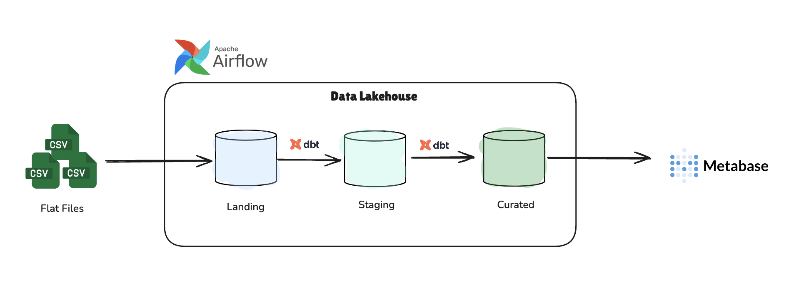
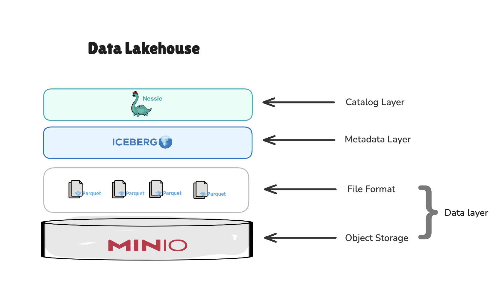
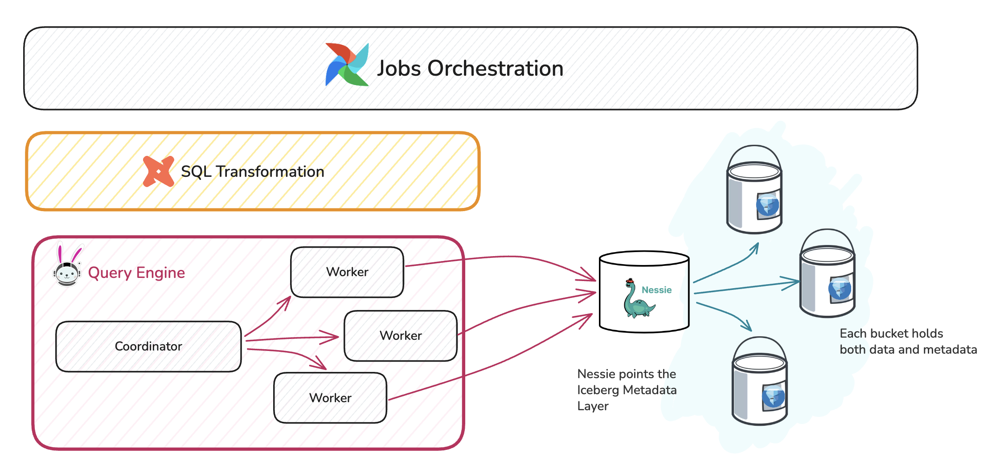
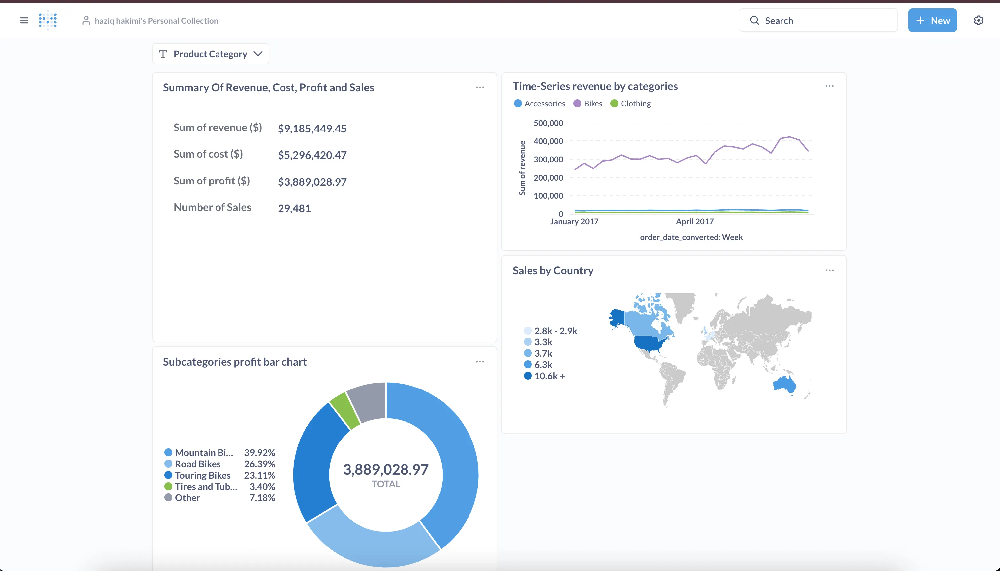
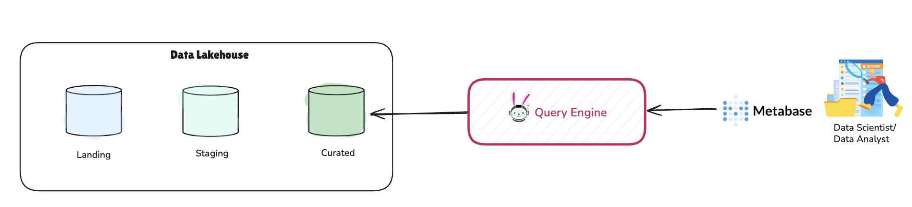
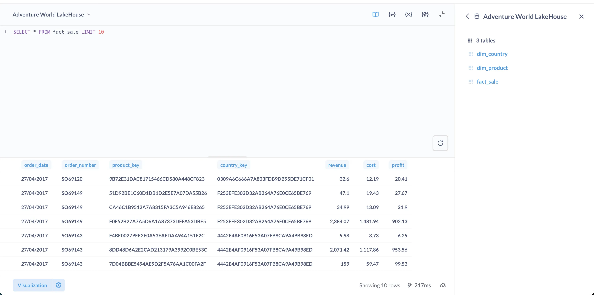

# Modern Data Lakehouse: From Raw Data to Analytics

A production-ready data lakehouse implementation demonstrating end-to-end data engineering using open-source technologies. This project showcases how to build a scalable, ACID-compliant lakehouse architecture with version control for data, transforming raw CSV files into analytics-ready dimensional models.

## Tech Stack


---



## Overview

This project implements a **medallion architecture** data lakehouse with three distinct layers:

- **Landing Layer**: Raw data ingestion from CSV files
- **Staging Layer**: Data cleaning, standardization, and type casting
- **Curated Layer**: Analytics-ready dimensional models (star schema)

The lakehouse processes sales data (orders, products, categories, territories) and transforms them into business intelligence-ready fact and dimension tables, enabling powerful analytics and visualizations through Metabase.

## Architecture

### Lakehouse Architecture Layers

The lakehouse is built on a modern **layered architecture** that separates concerns between storage, metadata management, and catalog operations. This design choice enables ACID transactions, version control, and schema evolution while maintaining performance and scalability.



**Architecture Layers:**

1. **Catalog Layer (Nessie)**: Provides Git-like version control for data tables, enabling branches, commits, and rollbacks
2. **Metadata Layer (Apache Iceberg)**: Manages table metadata, schema evolution, and partition information
3. **File Format (Parquet)**: Columnar storage format optimized for analytical queries
4. **Object Storage (MinIO)**: S3-compatible storage layer holding both data and metadata files

### Query Engine Architecture

The query processing is handled by a distributed **Trino cluster** orchestrated through Airflow and transformed using dbt. This architecture enables parallel processing and efficient query execution across large datasets.



**Query Execution Flow:**

1. **Orchestration Layer**: Airflow schedules and manages dbt transformation jobs
2. **Transformation Layer**: dbt compiles SQL models and executes them via Trino
3. **Query Engine**: Trino coordinator distributes work across worker nodes
4. **Catalog Integration**: Nessie resolves table locations and points to Iceberg metadata
5. **Data Access**: Iceberg metadata layer directs queries to the appropriate Parquet files in MinIO

This separation of concerns allows for:
- **Scalability**: Add more Trino workers as data volume grows
- **Version Control**: Track and rollback data changes via Nessie
- **Performance**: Distributed query execution with metadata pruning
- **Flexibility**: Swap storage backends without changing query logic

### Data Flow

```
CSV Files → Airflow → Landing (dbt seed) → Staging (dbt transformations) → Curated (dimensional models) → Metabase
```

1. **Ingestion**: CSV files loaded via dbt seed into Iceberg tables
2. **Transformation**: dbt models clean, standardize, and transform data across layers
3. **Modeling**: Dimensional star schema created with fact and dimension tables
4. **Analytics**: Metabase queries curated layer via Trino for dashboards and reports

## Features
### Lakehouse Capabilities
- **ACID Transactions**: Guaranteed data consistency across all operations
- **Time Travel**: Query historical data states and audit changes
- **Version Control**: Git-like operations for data tables (branches, commits, rollbacks)
- **Schema Evolution**: Add/modify columns without breaking existing queries
- **Distributed Processing**: Parallel query execution across Trino cluster

### Data Engineering
- **Three-Layer Medallion Architecture**: Separation of raw, cleaned, and curated data
- **Data Quality Testing**: dbt tests for uniqueness, null checks, and referential integrity
- **Dimensional Modeling**: Star schema optimized for analytics
- **Automated Orchestration**: Scheduled daily pipeline with dependency management
- **Calculated Metrics**: Business KPIs computed during transformation (revenue, cost, profit)
- **Custom Operators**: Custom dbt operator for local execution

### Analytics & Visualization
- **Self-Service BI**: Metabase dashboards for business users
- **Interactive Queries**: Ad-hoc SQL queries via Metabase interface
- **Performance Optimized**: Columnar Parquet format with partitioning

## Project Structure

```
lakehouse_pipelines/
├── dags/
│   ├── dbt_trino/               # dbt project
│   │   ├── seeds/               # CSV source files
│   │   ├── models/
│   │   │   ├── landing/         # Raw data models
│   │   │   ├── staging/         # Cleaned data models
│   │   │   └── curated/         # Dimensional models
│   │   ├── tests/               # Data quality tests
│   │   └── dbt_project.yml
│   └── dbt_dag.py               # Airflow DAG definition
├── docker/
│   ├── docker-compose-lake.yaml      # MinIO + Nessie
│   ├── docker-compose-trino.yaml     # Trino cluster
│   ├── docker-compose-airflow.yaml   # Airflow services
│   └── docker-compose-metabase.yaml  # Metabase BI
├── trino_config/
│   └── catalog/
│       └── iceberg.properties   # Iceberg-Nessie-MinIO integration
├── scripts/
│   └── managed-lakehouse.sh     # Startup script
└── pictures/                    # Architecture diagrams and screenshots
```

## Data Models

### Curated Layer (Analytics-Ready)

**Fact Table**
- `fact_sale`: Transaction-level sales facts
  - Dimensions: order_date, product_key, country_key
  - Metrics: revenue, cost, profit, order_number

**Dimension Tables**
- `dim_product`: Product hierarchy (category → subcategory → product)
- `dim_country`: Geographic territory information

### Pipeline DAG

The `dbt_pipeline` DAG runs daily with two main tasks:
1. **dbt_seed**: Load CSV files into landing layer
2. **dbt_run**: Execute transformation models (staging → curated)

## Analytics Dashboard

The project includes a custom Metabase dashboard showcasing:



- **Summary Metrics**: Total revenue, cost, profit, and number of sales
- **Time-Series Analysis**: Revenue trends by product category
- **Geographic Insights**: Sales distribution by country (map visualization)
- **Product Performance**: Profit breakdown by subcategory

### Querying the Curated Layer

Data analysts and data scientists interact with the lakehouse through Metabase, which connects to the Trino query engine to access analytics-ready data in the curated layer. This architecture separates the analytics interface from the underlying storage, enabling scalable query performance.



**Analytics Access Pattern:**
1. **Data Scientists/Analysts** use Metabase's intuitive interface for dashboards and ad-hoc queries
2. **Metabase** translates user interactions into SQL queries sent to Trino
3. **Query Engine (Trino)** executes distributed queries across the curated layer
4. **Curated Database** serves analytics-ready dimensional models optimized for business intelligence

This design enables self-service analytics while maintaining query performance through distributed processing.



The curated layer exposes three tables for analytics:
- `dim_country`: Territory and country information
- `dim_product`: Product catalog with hierarchies
- `fact_sale`: Sales transactions with calculated metrics

## Getting Started

### Prerequisites
- Docker and Docker Compose installed
- At least 4GB of available memory
- Ports 3000, 8080, 8081, 9000, 9001, 19120 available

### Quick Start

Run the automated startup script:

```bash
./scripts/managed-lakehouse.sh
```

This script will:
1. Start all required services (MinIO, Nessie, Trino, Airflow, Metabase)
2. Initialize the lakehouse infrastructure
3. Set up the data catalog and storage
4. Deploy the dbt pipeline
5. Configure Airflow and Metabase

### Access Points

Once running, access the services at:

- **Metabase**: http://localhost:3000 (BI dashboards)
- **Airflow**: http://localhost:8081 (Pipeline orchestration)
- **Trino**: http://localhost:8080 (Query engine)
- **MinIO**: http://localhost:9001 (Object storage console)
- **Nessie**: http://localhost:19120/api/v2 (Data catalog API)

### Default Credentials

**Airflow**
- Username: `airflow`
- Password: `airflow`

**Metabase**
- Username: `user@gmail.com`
- Password: (set during initial setup)

**MinIO**
- Access Key: (configured in .env)
- Secret Key: (configured in .env)

## Learn More

For a detailed walkthrough of the architecture, design decisions, and implementation details, read the comprehensive blog post:

[Building a Modern Data Lakehouse: From Raw Data to Analytics](https://medium.com/@haziqhakimi02/building-a-modern-data-lakehouse-from-raw-data-to-analytics-930c819f1c4c)

The blog covers:
- Lakehouse architecture principles
- Technology selection rationale
- Step-by-step implementation guide
- Data modeling best practices
- Performance optimization techniques
- Troubleshooting and debugging tips


## License

This project is open-source and available for educational and commercial use.

## Acknowledgments

Built with modern data engineering best practices, leveraging the power of:
- Apache Iceberg & Nessie for lakehouse capabilities
- Trino for distributed SQL processing
- dbt for analytics engineering
- Airflow for workflow orchestration
- Metabase for self-service analytics
